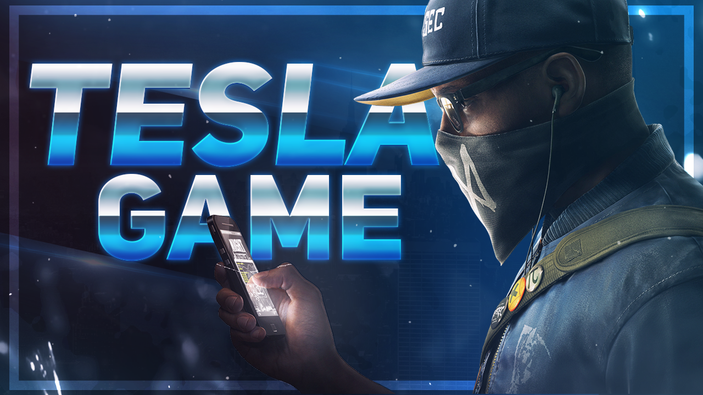
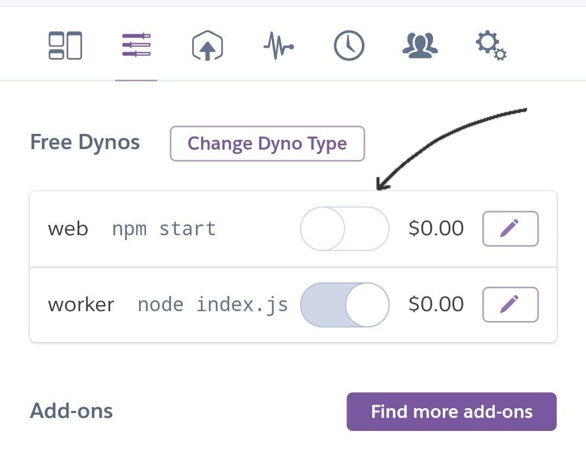
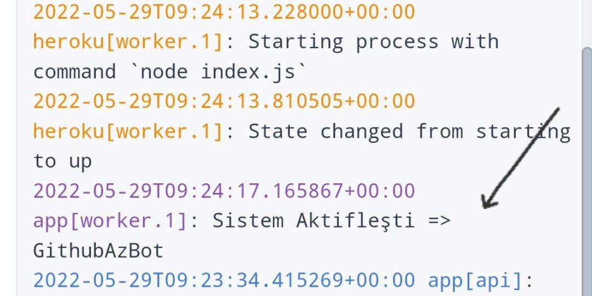

<div id="top"></div>


<!-- PROJE LOGO -->
<br />
<div align="center">
  <a href="https://github.com/sirincay/TeslaGameV1">
    
  </a>

  <h2 align="center"><a href="https://t.me/husnuehedov">🔍 TeslaGame Proje Sahibi: Hüsnü Ehedov</a></h2>

  <p align="center">
    <b>Merhaba, TeslaGameV1 Projesi ile Karşınızdayız. Bot 1 Yıldan Fazladır Telegram da Aktif Olarak<br/>Kullanıcılara Oyun Konusun da kolaylık Sağlıyor
Şuan Kullanılan <a href="https://t.me/TeslaGameBot" >@TeslaGameBot</a>'un <br/>
Eski Alt Versiyon Projesi GitHub'da Kullanıcılara Açık Sunuldu.</b>
<br/><br/>
<strong><a href="https://telegra.ph/TeslaGame-Türkçe-Oyun-Rehberi-05-29">Dökümanı Okuyun</a></strong>
    ·
    <strong><a href="https://t.me/husnuehedov">Hata Bildir</a></strong>
   </p>
</div>

### 🔹 Kolay Heroku Kurulum
  
[](https://heroku.com/deploy?template=https://github.com/sirincay/TeslaGameV1)  
 <i>Deploy Sonrası Yapılması Gerekenler:</i><br/>
      <i>web npm start butonu kapatın</i><br/>
     <br/>
      <i>Logda Aktif Gözücektir</i><br/>
      <br/>

### ⭐️ Linux Server Kurulum

1. Reponu Klonlayın
   ```sh
   git clone https://github.com/sirincay/TeslaGameV1
   cd TeslaGameV1
   ```
2. Telegraf,Environment Paketleri İndirin
   ```sh 
   npm install telegraf && npm install dotenv
   ```
3. `nano .env` Komutunu Kullanarak .env Dosyasını Düzenleyin
   ```.env
   TOKEN= Botun Tokeni Yazın @BotFather
   ID_BOT= Botun ID Yazın (İlk Rakamlar)
   BOT_ISMI= Botun Kullanıcı Adını '@' Olmadan Yazın
   RAUND_SAYI= RAUND SAYISI (3-5) İdeal aralık 
   SANIYE= Resimlerin Değişmesi Süresi / 10000=10 Saniye
   
    ```
4. Botu Başlatın.
   ```
   node botTesla.js
    ```

## Resim

- [ ] `resimler` Klasörüne resmi ekleyin. Resim İsmi İlk olarak belirtiğiniz rakamı yazın <br/>
- Örnek: `21_resim.jpg`
- Ve Bot Resimlerden Random Olarak Seçicektir

<!-- LICENSE -->
## License

GNU Affero Genel Kamu Lisansı altında paylaşılmaktadır. <br/>
Daha fazla bilgi için `LICENSE` bölümüne bakın. Copyright (C) 2022<br/>
Tüm hakları saklıdır!


## İletişim

Telegram- [@HusnuEhedov](https://t.me/husnuehedov)

Project Link: [https://github.com/sirincay/TeslaGameV1](https://github.com/sirincay/TeslaGameV1)


## Credit

* [mikhailsdv](https://github.com/mikhailsdv/guess-the-age-bot)


